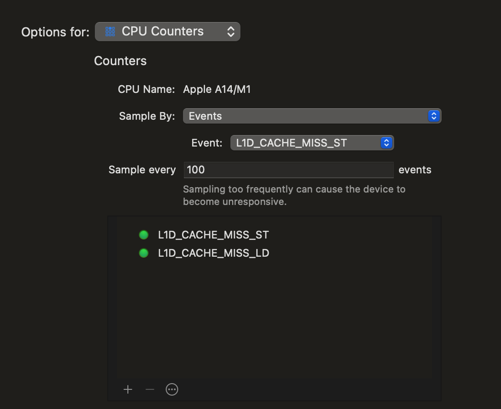
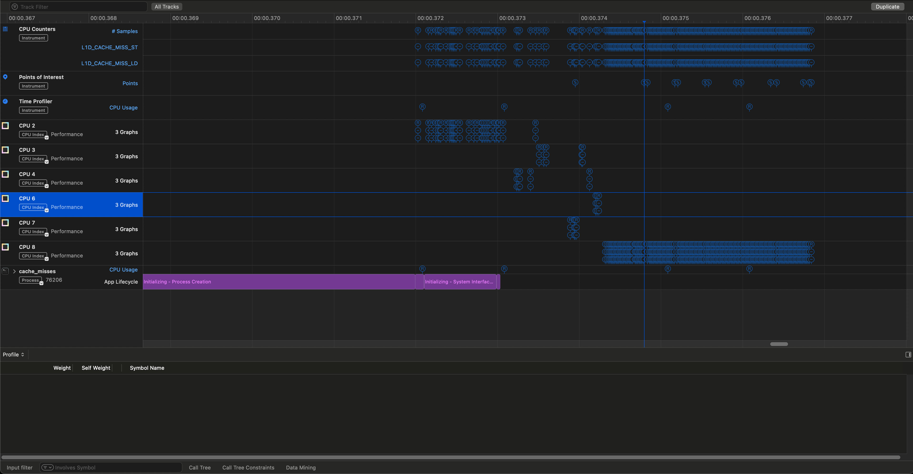
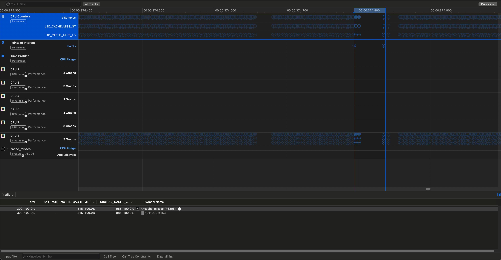
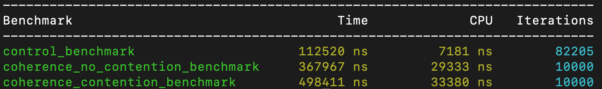
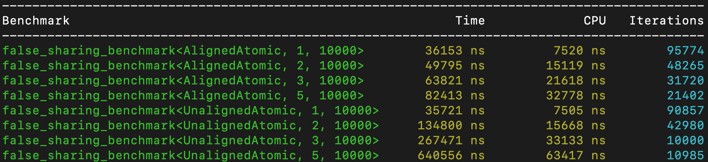
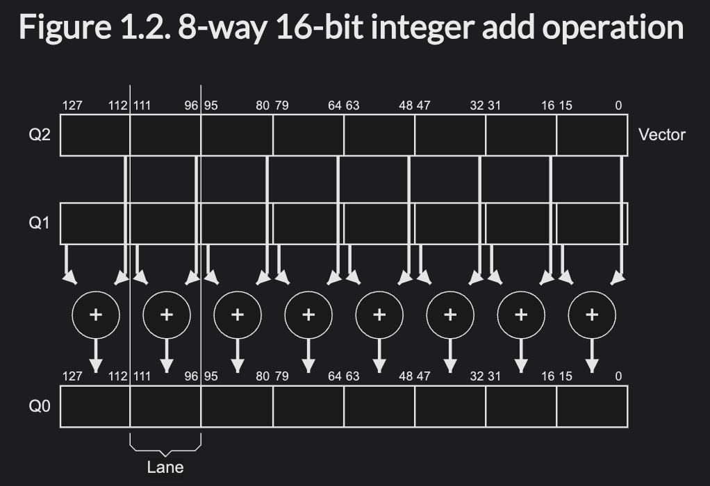
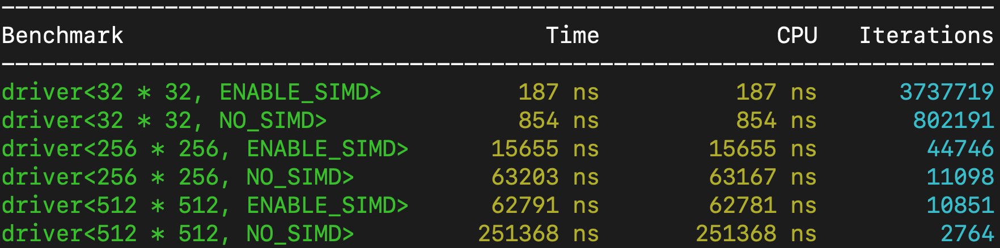

# Processor Cache Effects
Benchmarks illustrating various performance implications of processor cache effects. Benchmarks are run either via the [Google Benchmark framework](https://github.com/google/benchmark) or via standalone timed executables.

Inspired by Igor Ostrovsky's [Gallery of Processor Cache Effects](https://igoro.com/archive/gallery-of-processor-cache-effects/).

# Running
To run the repository, clone the repository and then from the repository root run the following to build the tests:

```shell
cmake .
make
```

To run each test, run any of:
* Cache Coherence Protocol
```
bin/single_var_cache_coherence
```
* False Sharing
```
bin/false_sharing_bench
```
* Cache Strides
    * `stride_sizes`: a space separated list of stride sizes to test
    * Alternatively, the environment variable `STRIDE_SIZES` can be set to a space separated string of stride sizes
```shell
bin/cache_strides_bench <stride_sizes>
bin/cache_strides_bench 1 2 4 8 16 32 64 128 256 512 1024
// OR
STRIDE_SIZES = "1 2 4 8 16 32 64 128 256 512 1024" bin/cache_strides_bench
```

# Benchmark Results
The following benchmarks are run on a Apple M1 Max (10 cores, 8 performance and 2 efficiency, clocked at 24 MHz) on MacOS 14 Sonoma with the following specs:
```
$ sysctl -a | grep -E 'hw\.(cachelinesize|l1icachesize|l1dcachesize|l2cachesize)'
hw.cachelinesize: 128
hw.l1icachesize: 131072
hw.l1dcachesize: 65536
hw.l2cachesize: 4194304
```
## Cache Misses and Cache Line Size
**Test name**: `cache_misses`

A natural first benchmark is to test intuitions around counting cache misses (particularly the L1 cache) as related to the cache line size, given that cache misses are a significant cause of latency increases. There are many kinds of cache misses -- compulsory, capacity, conflict, and coherence. This test uses a large array which does not fully fit in the L1 cache (which would cause cache misses due to capcity) and where each element is accessed once cold, creating a compulsory cache miss. Coherence cache misses are tested in a following experiment.

Each test accesses the a constant number of the array elements but separated by different strides. Given that a cache line (on the tested machine) is 128 bytes, the hypothesis is that the prefetched data in `CACHE_LINE_SIZE` bytes will cause small stride sizes to incur fewer cache misses, peaking at a `STRIDE_SIZE = CACHE_LINE_SIZE` and then plateauing. At this point, each element accessed would not have been prefetched so would incur a compulsory cache miss. Specifically, the hypothesis is:
```
Let N be the number of cache misses at the 128 byte stride mark. The hypothesis is:
- a stride S >= 128 bytes will have N cache misses
- a stride S < 128 bytes will have S / 128 * N cache misses 

where `N` is the number of unique elements accessed in the array. 
```

### Profiling Set Up:
Given MacOS does not have access to Linux specific tools such as `perf` which accesses hardware performance monitoring counters, the standard MacOS XCode Instruments tool is used for performance profiling. This is the same tool used to profile Apple Swift apps. The `CPU Counters` tool can periodically (by time or event count) sample hardware counters. The `L1D_CACHE_MISS_ST` and `L1D_CACHE_MISS_LD` counters were selected to measure L1 cache misses. Sampling was initially done by time, but even with high frequency sampling there is no guarantee every stride will have sufficient samples. Instead, samples are taken periodically based on number of `L1D_CACHE_MISS_ST` (every 100 events for sufficient granularity for low stride sizes). The `L1D_CACHE_MISS_ST` was chosen instead of `L1D_CACHE_MISS_LD` because, as visible in the graph, there are a much larger number of `L1D_CACHE_MISS_LD` (10s of thousands) so this reduces sample clumping. This is because the vector of atomics is reset at the start of each new stride test.



To allow one script to run multiple stride sizes, the Apple Logging API (via [os_log_t](https://developer.apple.com/documentation/os/logging/os_log_t)) is used to set "Points of Interest" which delineate each stride size so the sampled metrics in the desired interval can be aggregated. This is so any metrics collected during app start up or in setting up each test iteration is ignored.

### Results
The result of the profiling looks like the below:



On the `Points of Interest` row, the 14 markers indicated by `S` delineate the test sections: Start, 6 stride sizes (start/end), and End. The sampling intervals do not line up exactly with the points of interest, so approximation by summing the surrounding intervals is done. This is an example of zooming into the first stride length.



Doing this for all stride lengths gives the following results:

| Stride Size (Bytes) | L1D_CACHE_MISS_ST (events) | L1D_CACHE_MISS_LD (events) |
|---------------------|---------------------------:|---------------------------:|
| 1                   | 315                        | 985                        |
| 4                   | 777                        | 1447                       |
| 16                  | 1517                       | 2672                       |
| 64                  | 4228                       | 7015                       |
| 128                 | 6447                       | 12544                      |
| 256                 | 6739                       | 13273                      |

This shows that indeed after a stride size of the cache line size of 128 bytes is reached, the number of cache misses plateaus. 

However, initially it was expected that stride size 1 would have `N / 128 = 10k / 128 ~= 78` cache misses for stores and loads, but the actual number is larger. Further, it was expected that the number of cache misses would increase by the stride size factor (4), but it appears each factor of 4 stride size only increases cache misses by 2x. Last, it was initially expected that the cache misses between loads and stores would be the same, but loads have about 2x as many cache misses as stores. Further investigation is required to explain these observations.

## Coherence Cache Misses
**Test name**: `single_var_cache_coherence`

Machines use various cache coherence protocols, many of them proprietary, but it is safe to assume they are based on the MESI protocol, a write-back protocol which saves considerable bandwidth vs write-through protocols. This is necessary for cache coherency on multi-core machines, which share main memory but have disjoint L2/L1 caches which must be synchronized for consistent views of main memory. This protocol marks *cache lines* as one of four states (modified, exclusive, shared, invalid - hence the acronym) and defines a [state transition diagram](https://en.wikipedia.org/wiki/MESI_protocol#Operation) between the states based on whether a cache line is read or written by a given cache. Notably, when a cache line on Cache #1 is in a Shared (read-only) state and the data on the cache line is modified in Cache #2, the Cache #1 line is marked as invalid, and threads on the core will need to fetch the data again from a lower level cache. 

This is related to the `False Sharing` benchmark (when different variables share a cache line), but this benchmark shows the effect for the same variable.

Three tests were run:
- Control Benchmark: a single thread non-atomic load operation with no contention as a baseline for an integer load.
- Coherence No Contention: two threads which only load an atomic variable (read only), which should leave the cache line in a Shared (S) state
- Coherence Contention: two threads, one of which loads an atomic variable and the other which repeatedly stores a constant value in the variable. This causes the Shared (S) cache line to be invalidated in the reader thread, causing a flush and cache miss. 



## False Sharing
**Test name**: `false_sharing_bench`

Illustrates performance effect of `N` variables occupying the same cacheline which are modified by different threads. 

The below shows the Google Benchmark output from the `false_sharing` benchmark where the columns are `Time` (average wall clock time over the `Iterations` tested) and `CPU` (the `CPU` time of the main thread). Note that the `CPU` time only measures time spent by the main thread (see [Google Benchmark Docs](https://github.com/google/benchmark/blob/main/docs/user_guide.md#cpu-timers)), not the `N` spawned threads, so the wallclock time is analyzed in this case. 

The tests are segmented by the atomic type (unaligned or aligned to a multiple of the cache line size), the number of threads (up to 5) and the number of `fetch_add` operations for each thread to execute on its atomic variable. 

For the `AlignedAtomic`, the results show approximately linear growth in the wall clock time with respect to the number of threads, possibly due to core contention or cross core resource contention (L3 cache, memory bandwidth). While it's likely each thread is run on it's own core, MacOS thread scheduling is transparent to the user. In contrast, the `UnalignedAtomic` shows an order of magnitude higher wall clock latency due to the false sharing of the single cache line containing the atomic variables.



## Cache Line Size
**Test name**: `cache_strides_bench`

This test is intended to illustrate the effect of cache line prefetching on modifying elements in an array with different stride sizes. 

The test takes an array of constant size, traverses the array of `char`s, and increments every `stride_size` element. The `stride_size` is varied in powers of two. The result is each increasing `stride_size` updates `1/2` as many elements as the prior `stride_size`. However, processors fetch data in cache lines (typically 64 bytes, or in the case of the tested machine 128 bytes) and if data fetching time from memory dominates the time to increment an element, then we would expect a graph like that from the classic [Gallery of Processor Effects](https://igoro.com/archive/gallery-of-processor-cache-effects/) in "Example 2: Impact of cache lines" where stride sizes up to the cache line size have comparable operation time and time decreases by `1/2` thereafter.

The `cache_strides` test attempts to replicate these results, repeating tests per `stride_size` for multiple iterations (`NUM_ITER`). The total array size (`NUM_STRIDES * NUM_ITER`) was selected to be large enough that it cannot be stored in the L2 cache, so repeatedly cycling through the array in order should cause L2 cache misses for each access. 

Summary statistics of these results are shown below:

| Stride Size (bytes) | Min Time (us) | Median Time (us) | Max Time (us) |
|--------------------:|--------------:|----------------:|--------------:|
| 1                   | 56751         | 64222           | 88383         |
| 2                   | 27906         | 28330           | 29445         |
| 4                   | 13868         | 13963           | 14782         |
| 8                   | 6823          | 6960            | 13638         |
| 16                  | 3328          | 3353            | 4158          |
| 32                  | 2283          | 2326            | 5366          |
| 64                  | 2248          | 2272            | 2862          |
| 128                 | 3114          | 3192            | 3559          |
| 256                 | 1779          | 1793            | 2033          |
| 512                 | 866           | 876             | 906           |
| 1024                | 480           | 487             | 593           |

The results can be split into three regimens: 
* Regimen 1: `[1, 2, 4, 8, 16]`
* Regimen 2: `[32, 64, 128]`
* Regimen 3: `[256, 512, 1024]`

Unexpectedly, the median latency across iterations decreases by a factor of 2 for regimen 1. The latency then approximately plateauing for regimen 2. This trend of constant latencies was expected for all stride sizes `<= CACHE_LINE_SIZE` (in this case 128 bytes). For regimen 3, the median time continues to decrease by a factor of 2, as expected. Additional investigation is needed to understand why regimen 1 behaves differently than regimen 2.

The disassembled object file for this test is output to `asm/cache_strides.cpp.s` for more detailed analysis. 

## SIMD 
**Test name**: `simd_dot`

This code demonstrates how to benchmark SIMD operations using the ARM NEON SIMD intrinsics and compares it with the standard scalar dot product using `std::inner_product`. The code benchmarks the dot product of two vectors of different sizes using the Google Benchmark framework, comparing the performance of SIMD-based computations with scalar computations. The SIMD operations are benchmarked using a `float32x4_t` which represents a 128-bit register holding a vector of 4 single precision floating point numbers. 

ARMv7 supports special 128-bit vector registers (the `Q`, as opposed to the 64 bit `D` registers) which are partitioned into "lanes". Operations such as addition and multiplication are performed in parallel between two such vector registers. Here is an illustrative image of a parallel addition of eight 16-bit registers between two vector registers, `Q1` and `Q2`, where the result is stored in `Q0`. Image taken from the [ARM NEON overview.](https://developer.arm.com/documentation/dht0002/a/Introducing-NEON/What-is-NEON-).



The two are compared across different array sizes, representing 32-bit floating point dot products between different square images.

In general, the SIMD operations demonstrate a 4x speed up over the `std::inner_product`.



# Appendix

## Strong and Weakly Ordered Architectures
Some of the prior benchmarks use atomic operations which require certain ordering parameters. Note that x86-64 architectures are strongly ordered for almost all operations, meaning a `std::memory_order_relaxed` atomic operation will almost always generate the same assembly as a `std::memory_order_acquire/std::memory_order_release`. In contrast, architectures like ARM are weakly ordered meaning relaxed and other memory orderings generate different assembly instructions which indicate different "happens before" guarantees.

For example, the following code 
```
int x = val.load(std::memory_order_relaxed);
x = val.load(std::memory_order_acquire);
```

would generate assembly similar to the following on ARM64 
```
ldr w0, [x0]
ldar w1, [x1]
```
where `ldr` is a relaxed register load while the `ldar` is a load-acquire register. 

while on x86-64 it would generate something like the following
```
mov     dword ptr [rbp - 52], eax
mov     dword ptr [rbp - 56], eax
```
where `mov` is the same assembly instruction despite the memory ordering difference.
